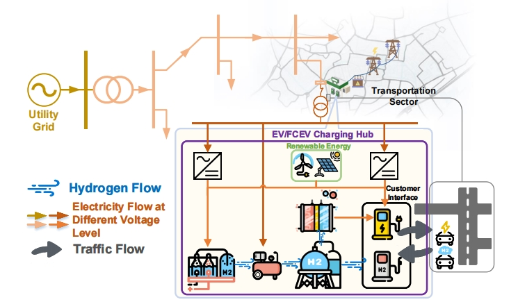
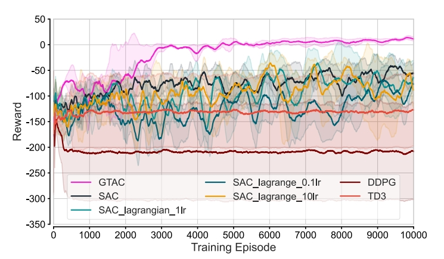
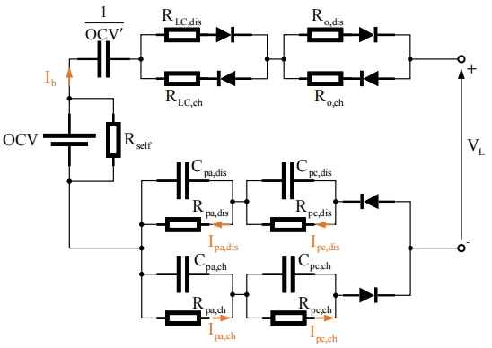
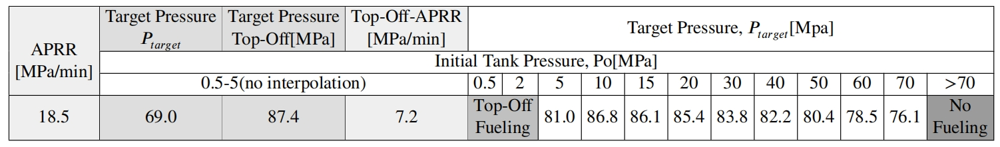

# Charging-hub Deep Reinforcement Learning Environment


This repository is the official implementation of the charging-hub environment used in our paper [Adaptive Infinite-Horizon Control of Hybrid EV/FCEV Charging Hubs: A Large-Model Based Deep Reinforcement Learning Approach](https://no).

<p float="left">
  
  
</p>


## Key Features of ChargingHub ENV ⭐:
- 🛠️ **Advanced EV Charging Model**: Advanced Second-Order FreedomCar battery model is utilized to simulate EV charging.
  

- ⚙️ **Advanced FCEV Fueling Model**: Incorporate the SAE J2601 fueling protocol to simulate FCEV refueling.
  

- 🌐🌍 **Real-World Data Integration**: The environment model is built using real-world data sources, including traffic patterns, renewable energy production, electricity prices, EV/FCEV parameters, electrolyzers, and fuel cells. This ensures the model can provide actionable insights under real-world conditions, improving accuracy and practicality.

## Getting started 🚀:


### Installation via Python pip 🐍

- Known dependencies: Ubuntu (18.04), Python (3.7), OpenAI gym (0.18.3), Boost (1.69.0)

1. **Build Boost.Python**:
   Follow these steps to build Boost.Python:
   ```bash
   cd /
   wget -O boost_1_69_0.tar.gz https://sourceforge.net/projects/boost/files/boost/1.69.0/boost_1_69_0.tar.gz/download
   tar -zxvf boost_1_69_0.tar.gz
   cd boost_1_69_0
   ./bootstrap.sh --with-libraries=python --with-toolset=gcc
   ./b2 cflags='-fPIC' cxxflags='-fPIC' --with-python include="/usr/include/python3.7m/"
   ./b2 install
   cd stage/lib
   ln -s libboost_python37.so libboost_python.so
   ln -s libboost_python37.a libboost_python.a
   echo 'export LD_LIBRARY_PATH=/boost_1_69_0/stage/lib:$LD_LIBRARY_PATH' >> ~/.bashrc
   source ~/.bashrc
   ```

2. **Clone ChargingHub ENV and Run Your First Script**:
   Clone the repository and install the Python dependencies:
   ```bash
   git clone https://github.com/XJTU-Power-AI/charginghub-env.git
   cd charginghub-env
   pip install -e.
   cd test && python env_test.py
   ```
   This will execute your first reinforcement learning environment.
   
   **[Optional]** If you have made modifications to the C++ source code and need to manually compile it, you can use the following command to compile `main.cpp` into a shared library (`pyevstation.so`):
      ```bash
      g++ main.cpp -shared -fPIC -o pyevstation.so -I /boost_1_69_0 -L /boost_1_69_0/stage/lib -lboost_python -I /usr/include/python3.7m/
      ```
   This will generate the shared library `pyevstation.so`, which is necessary for interacting with Python.
   

### Quick Start with Docker 🐳

1. **Build Docker Image**:

   First, clone the repository and navigate to the project directory:

   ```bash
   git clone https://github.com/XJTU-Power-AI/charginghub-env.git
   cd charginghub-env
   ```

   Then, build the Docker image using the following command:

   ```bash
   docker build -t charging-hub-env .
   ```

   This will create a Docker image with the necessary environment to run the ChargingHub project.

2. **Run Docker Container**:

   Once the image is built, you can run the Docker container:

   ```bash
   docker run -it charging-hub-env
   ```

   This will start the container, and the `env_test.py` script will be automatically executed as defined in the Dockerfile.

### Pull Pre-built Docker Image from Docker Hub 🐳

   For an even faster setup, you can pull the pre-built Docker image directly from Docker Hub. This eliminates the need to build the image yourself.
1. **Pull the Pre-built Image**:
   
   Use the following command to pull the pre-built image:
   
   ```bash
   docker pull christtzm/charginghub-env:v6.0
   ```

2. **Run the Docker Container**:
   
   Once the image is pulled, you can run the Docker container with the following command:
   
   ```bash
   docker run -it christtzm/charginghub-env:v6.0
   ```
   
   This will start the container, and the `env_test.py` script will be executed automatically.

## Paper Citation

If you used this environment for your experiments or found it helpful, consider citing our paper:

<pre>
bib
</pre>
